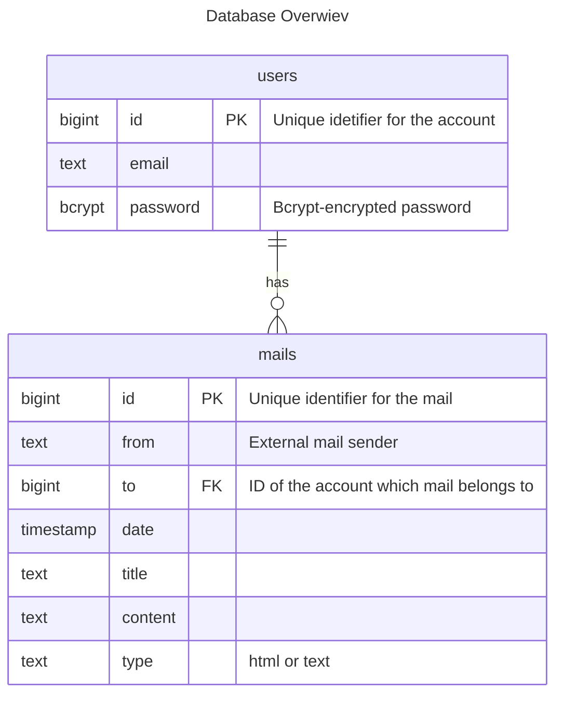

# kolpo-backend
Back end service for the mock mail system.

## SQL Schema

```mermaid
---
title: Database Overwiev
---
erDiagram
    users {
        bigint id PK "Unique idetifier for the account"
        text email
        bcrypt password "Bcrypt-encrypted password"
    }

    mails {
        bigint id PK "Unique identifier for the mail"
        text from "External mail sender"
        bigint to FK "ID of the account which mail belongs to"
        timestamp date
        text title
        text content
        text type "html or text"
    }

    users ||--o{ mails : has
```
